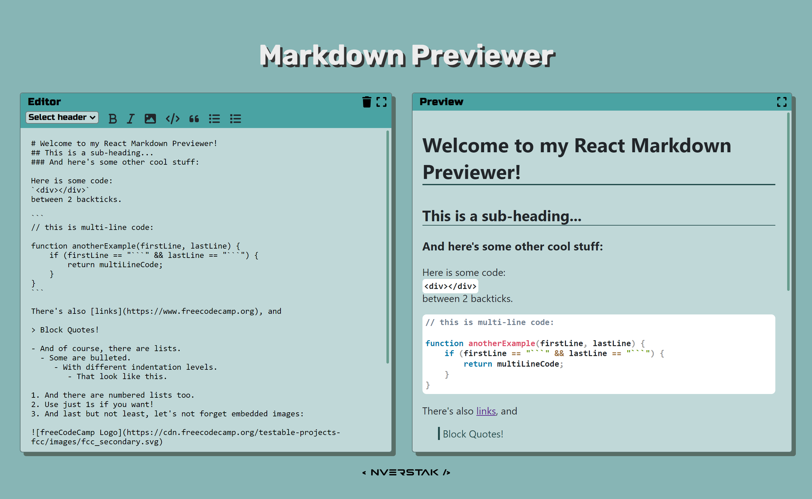
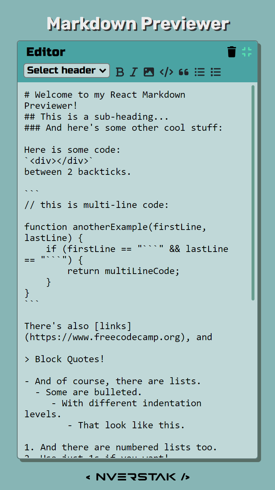

# Overview

Markdown Previewer is a web application that allows users to enter Markdown text and see a real-time preview of the rendered HTML output. The app follows a set of **user stories** to ensure the required functionality is implemented correctly:

-   [ ] User can see a textarea element with a corresponding id="editor".
-   [ ] User can see an element with a corresponding id="preview".
-   [ ] When the user enters text into the #editor element, the #preview element is updated in real-time to display the rendered HTML content of the textarea.
-   [ ] When the user enters GitHub-flavored Markdown into the #editor element, the text is rendered as HTML in the #preview element as they type.
-   [ ] When the Markdown Previewer first loads, the #editor field contains default text that represents various Markdown elements, such as headings, links, code blocks, lists, blockquotes, images, and bolded text.
-   [ ] When the Markdown Previewer first loads, the default Markdown in the #editor field is rendered as HTML in the #preview element.

The app is deployed at the following link: **https://md-previewer.onrender.com/**.

## Technologies

HTML, JS, React, SASS/SCSS, Font Awesome, Marked, Prismjs.

## Appearance

## How to launch locally

In the project directory you should:

-   Install dependencies

    `npm install`

-   Start the project

    `npm run dev`

Runs the app in development mode.\
Open [http://localhost:5173](http://localhost:5173) to view it in your browser.

The page will reload when you make changes.\
You may also see any lint errors in the console.

## Acknowledgements

The Technotes project is inspired by the FreeCodeCamp "Build a Markdown Previewer" challenge.
